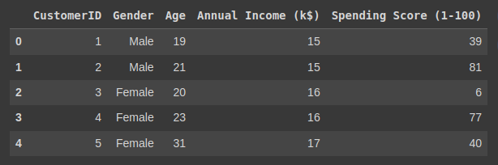
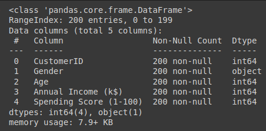
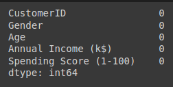
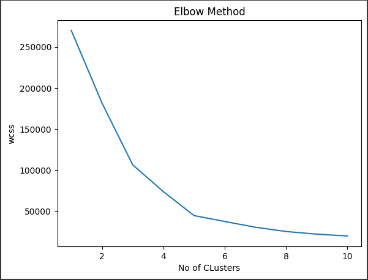
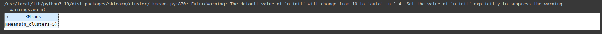
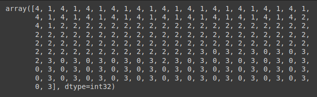
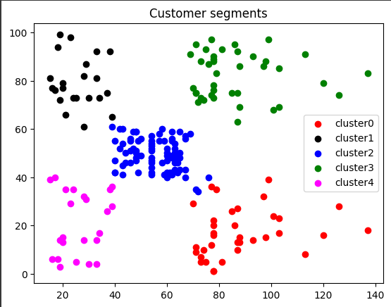

# Implementation-of-K-Means-Clustering-for-Customer-Segmentation

## AIM:
To write a program to implement the K Means Clustering for Customer Segmentation.

## Equipments Required:
1. Hardware – PCs
2. Anaconda – Python 3.7 Installation / Jupyter notebook

## Algorithm

```md
1. Import the necessary Libraries and read the given csv file.
2. Explore the data.
3. Implement K-Means Clustering.
4. Implement Elbow method.
5. Cluster the data.
6. Visualize the data.
```

## Program:
```python

# Program to implement the K Means Clustering for Customer Segmentation.
# Developed by   : Sam Israel D 
# RegisterNumber : 212222230128

```
#### Importing necessary libraries
```python
import pandas as pd
import matplotlib.pyplot as plt
df = pd.read_csv('Mall_Customers.csv')
df.head()
```
#### Data Exploration
```python
df.info()
df.isnull().sum()
```
#### K-Means Clustering
```python
from sklearn.cluster import KMeans
wcss = []
for i in range(1,11):
    kmeans = KMeans(n_clusters = i, init = 'k-means++' )
    kmeans.fit(df.iloc[:,3:])
    wcss.append(kmeans.inertia_)
```
#### Elbow Method plot
```python
plt.plot(range(1,11), wcss)
plt.xlabel('No of CLusters')
plt.ylabel('wcss')
plt.title('Elbow Method')
```
#### Cluster the data
```python
km = KMeans(n_clusters = 5)
km.fit(df.iloc[:,3:])
```
#### Prediction
```python
y_pred = km.predict(df.iloc[:,3:])
y_pred
```
#### Visualization
```python
df['cluster'] = y_pred
df0 = df[df['cluster'] == 0]
df1 = df[df['cluster'] == 1]
df2 = df[df['cluster'] == 2]
df3 = df[df['cluster'] == 3]
df4 = df[df['cluster'] == 4]

plt.scatter(df0["Annual Income (k$)"], df0['Spending Score (1-100)'], c = 'red', label = 'cluster0')
plt.scatter(df1["Annual Income (k$)"], df1['Spending Score (1-100)'], c = 'black', label = 'cluster1')
plt.scatter(df2["Annual Income (k$)"], df2['Spending Score (1-100)'], c = 'blue', label = 'cluster2')
plt.scatter(df3["Annual Income (k$)"], df3['Spending Score (1-100)'], c = 'green', label = 'cluster3')
plt.scatter(df4["Annual Income (k$)"], df4['Spending Score (1-100)'], c = 'magenta', label = 'cluster4')

plt.legend()
plt.title('Customer segments')
```

## Output:

#### df.head()

#### df.info()

#### df.isnull().sum()

#### Elbow method graph

#### KMeans Clusters

#### y_pred

#### Customer Segments Graph



## Result:
Thus the program to implement the K Means Clustering for Customer Segmentation is written and verified using python programming.